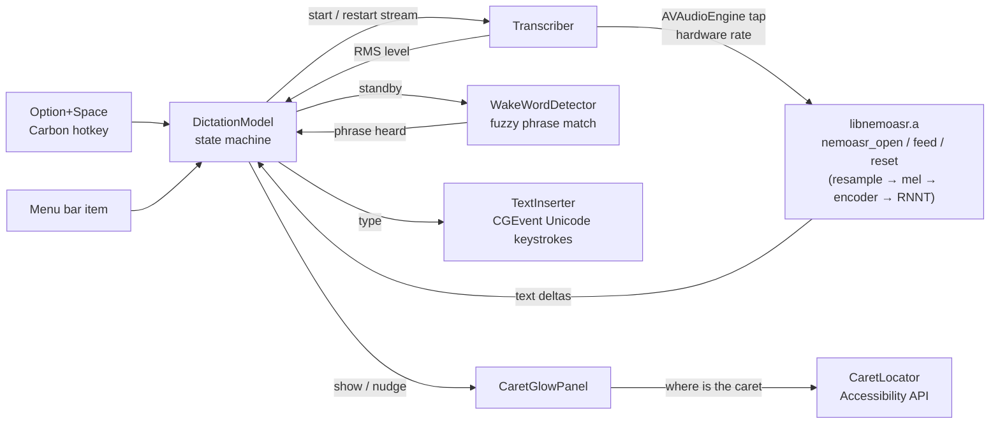

# NemoDictate

A native macOS menu-bar app for local speech recognition, built on [nemoasr-c](../nemoasr-c): NVIDIA Nemotron 3.5 ASR Streaming 0.6B implemented from scratch in C + Metal. Swift for the app, the C runtime linked in as a static library. Nothing leaves the machine.

What you say is typed straight into whatever text field has keyboard focus, in any app. There is no window: the only feedback is a slight glow on that field's insertion point, with a small black square under it (네모, Nemo, is Korean for square), and the menu-bar icon.

- **Push to talk.** Press **Option + Space** (or the menu item) with a text field focused, speak, press it again. The model loads on demand each time, about 300 ms including GPU warm-up, and is released afterwards, so the app costs nothing while idle.
- **Wake-word mode** (Wake word menu) keeps the microphone and the model running all the time. The menu-bar icon turns into a teal ear; say the trigger phrase ("hey nemo" by default, set your own) and a segment starts, anything said in the same breath after the phrase is kept. It stops by itself after 1.5 / 2.5 / 4 s without new words and goes back to waiting for the phrase. Option + Space starts a segment without the phrase, or ends one early.

## Build and run

```bash
./Scripts/bundle.sh      # builds ../nemoasr-c as libnemoasr.a, then the app, then build/NemoDictate.app
open build/NemoDictate.app
```

The first start asks for microphone access. The ASR model must be present in the Hugging Face cache (`~/.cache/huggingface/hub/models--mlx-community--nemotron-3.5-asr-streaming-0.6b`); running the Python project in `../nemoasr` once downloads it.

Typing into other apps needs the **Accessibility** permission (System Settings → Privacy & Security → Accessibility). The first attempt raises the system prompt; add NemoDictate there. macOS ties that permission to the app's code signature, so `Scripts/bundle.sh` signs with your Apple Development (or Developer ID) certificate when `security find-identity` shows one, which keeps the permission across rebuilds; with only an ad-hoc signature it would have to be re-added after every build. `CODESIGN_ID` overrides the choice. Without the permission the text of a segment goes to the clipboard instead and the menu's status line says why.

Menu bar: Start/Stop Dictating, Copy Last Transcript, Language (auto-detect, English, Korean, Japanese, …), Chunk latency (80 / 320 / 560 / 1120 ms), Microphone (System Default or any connected input; the list is refreshed every time the menu opens), Wake word (enable always-listening mode, set the phrase, silence timeout), Quit. The first line of the menu is the status line. Everything persists; the microphone is remembered by its device UID, and if it is not connected the app falls back to the system default and says so.

## How it fits together



| File | Role |
|---|---|
| `Sources/NemoDictate/App.swift` | `NSApplication` bootstrap, accessory (menu-bar only) app, wires hotkey, menu and caret glow |
| `DictationModel.swift` | idle → loading → (standby ⇄) listening → finishing → done state, transcript, stream switching, silence timeout, persisted settings |
| `Transcriber.swift` | microphone permission, `AVAudioEngine` input tap, mono mix and level, calls into the C library on a serial queue, stream restarts tagged with a generation |
| `TextInserter.swift` | Accessibility check and prompt, typing text into the focused app through `CGEvent` keyboard events |
| `CaretGlowPanel.swift` | click-through panel that follows the insertion point: AX notifications, gliding motion, the glow and the square logo |
| `Sources/NemoCaret/CaretLocator.swift` | insertion-point lookup through the Accessibility API, including waking up browser and Electron accessibility trees |
| `StatusBarController.swift` | `NSStatusItem`, menu, status line, checkmarks for language, latency, microphone and wake-word settings |
| `HotKey.swift` | system-wide hotkey through `RegisterEventHotKey` (no accessibility permission needed) |
| `DebugLog.swift` | short lines to `~/Library/Logs/NemoDictate.log` about trust, what standby heard, and caret lookups |
| `Sources/NemoAudio/AudioInputDevice.swift` | CoreAudio input device enumeration (name, UID, rate, channels), shared with `nemo-feed --list-mics` |
| `Sources/NemoAudio/WakeWordDetector.swift` | trigger-phrase matching on streaming words, per-word and run-together edit distance, split-word handling |
| `Sources/CNemoASR` | module map exposing `../nemoasr-c/src/nemoasr.h` to Swift |
| `Sources/nemo-feed` | headless checks: feed an audio file through the same bridge, exercise the stream restart, list microphones, run the wake-word matcher |
| `Scripts/bundle.sh`, `Resources/Info.plist` | assembles and signs the `.app` (`LSUIElement`, microphone usage string) |

## The caret glow

The glow finds the insertion point through the Accessibility API of the focused app: the bounds of the selected text range (the empty range itself, or the character after or before the caret), then WebKit/Chromium text-marker ranges (walking one character from the selection's end marker, since a collapsed marker range's bounds are the paragraph's), then, for a small single-line field only, its left edge. If none of those answer, nothing is shown rather than guessing.

Browsers and Electron apps keep their web accessibility tree switched off until an assistive client shows up. Electron apps are asked with `AXManualAccessibility`. Chrome and its forks only honour the flag VoiceOver sets, `AXEnhancedUserInterface`, and switch their tree on about two seconds later, so the first dictation in a browser takes that long to show the glow; the flag is cleared after ten idle minutes and on quit because Chrome animates window moves while it is set.

Position changes arrive through an `AXObserver` (selection, value, focus, window moves) plus a slow safety poll; the window eases toward each new position with an 85 ms time constant, reappears in place for far moves, and stays put through the momentary misses editors produce while keystrokes land. `~/Library/Logs/NemoDictate.log` records which strategy answered and the DOM element being tracked, for apps that misbehave.

## Wake word

While standing by, the recogniser runs pinned to English at a 320 ms chunk, whatever the dictation language, so the trigger is recognised quickly and no matter what language you were just speaking. Each segment restarts the stream (`nemoasr_reset`, same loaded model) in your chosen language and latency; the end of a segment flushes its last words and restarts the stream in English. Text is tagged with a stream generation so nothing decoded before a switch leaks into the next state. After 15 s without a word, while the room is quiet, the wake stream is restarted so it never sits on a long history of silence.

The trigger is matched on the ASR output word by word with a small edit distance per word (0 for words up to three letters, 1 up to five, 2 beyond), and also as a run-together string, so "hey nimo", "heynemo" and "hey, Nemo," all fire while "hey nemesis" does not. Only the words that just arrived can complete the phrase. A word split across two chunks ("Spar" then "k") is glued back together, and a match whose last word is only a prefix of the wake word is held for 0.4 s for its ending. Pick a phrase the model spells consistently; the log shows exactly what standby heard for every chunk and what the matcher decided, so a wake word that gets missed can be diagnosed from there. `swift run nemo-feed --wake-test "your phrase"` runs the matcher over synthetic chunks.

## Headless checks

`swift run nemo-feed ../nemoasr-c/ref/fox48k.wav` transcribes a file through the exact Swift-to-C path the app uses, without a microphone. `swift run nemo-feed --reset-test ../nemoasr-c/ref/mixed.wav` feeds half a file as an English 320 ms stream, restarts the stream as auto-detect 560 ms and feeds the rest, the switch the wake-word mode does at every segment. `swift run nemo-feed --list-mics` prints the input devices the menu shows. `NEMO_DEMO=caret swift run NemoDictate` shows the glow at a fixed spot with fake typing ticks, for working on the effect.

## Notes

- The hotkey is fixed to Option + Space in `App.swift`. Change `kVK_Space` / `optionKey` there if it clashes with something you use.
- Audio is captured at the device's native rate and resampled inside the C library (windowed sinc), the same path the CLI uses.
- Latency 560 ms is the default for dictation: text appears about 0.6 s behind your speech. 80 ms is snappier but less accurate.
- In wake-word mode the model stays loaded (about 1.6 GB peak memory footprint) and the GPU runs one encoder chunk per latency interval; it is meant for a session, not for leaving on for days.
- The app has no custom icon yet; the menu bar uses SF Symbols.
