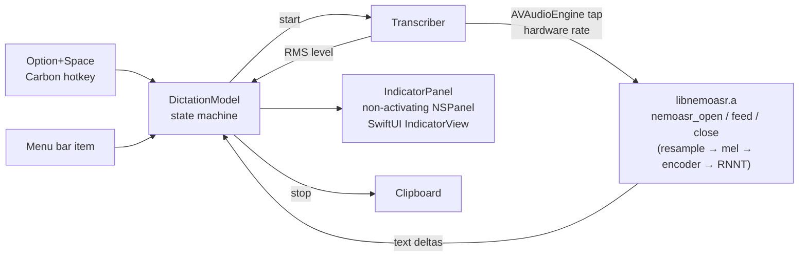

# NemoDictate

A native macOS menu-bar app for local speech recognition, built on [nemoasr-c](../nemoasr-c): NVIDIA Nemotron 3.5 ASR Streaming 0.6B implemented from scratch in C + Metal. Swift/SwiftUI for the app, the C runtime linked in as a static library. Nothing leaves the machine.

- Press **Option + Space** (or click the microphone in the menu bar) to start. A floating pill appears at the top of the screen with a pulsing dot, a live waveform of your input level and the transcript streaming in as you speak.
- Press Option + Space again (or the stop button on the pill) to finish. The text is copied to the clipboard, the pill shows a check mark and fades out.
- The model loads on demand each time you start, about 300 ms including GPU warm-up, and is released when you stop, so the app costs nothing while idle.

## Build and run

```bash
./Scripts/bundle.sh      # builds ../nemoasr-c as libnemoasr.a, then the app, then build/NemoDictate.app
open build/NemoDictate.app
```

The first start asks for microphone access. The ASR model must be present in the Hugging Face cache (`~/.cache/huggingface/hub/models--mlx-community--nemotron-3.5-asr-streaming-0.6b`); running the Python project in `../nemoasr` once downloads it.

Menu bar: Start/Stop, Copy Last Transcript, Language (auto-detect, English, Korean, Japanese, …), Chunk latency (80 / 320 / 560 / 1120 ms), Microphone (System Default or any connected input; the list is refreshed every time the menu opens), Quit. Language, latency and microphone persist; the microphone is remembered by its device UID, and if it is not connected the app falls back to the system default and says so in the status line.

## How it fits together



| File | Role |
|---|---|
| `Sources/NemoDictate/App.swift` | `NSApplication` bootstrap, accessory (menu-bar only) app, wires hotkey, menu and panel |
| `DictationModel.swift` | idle → loading → listening → finishing → done state, transcript, level, persisted settings |
| `Transcriber.swift` | microphone permission, `AVAudioEngine` input tap, mono mix and level, calls into the C library on a serial queue |
| `IndicatorPanel.swift` / `IndicatorView.swift` | the floating pill: borderless non-activating panel on all Spaces, SwiftUI content with pulsing state dot, waveform bars, streaming text, status |
| `StatusBarController.swift` | `NSStatusItem`, menu, checkmarks for language and latency |
| `HotKey.swift` | system-wide hotkey through `RegisterEventHotKey` (no accessibility permission needed) |
| `Sources/NemoAudio/AudioInputDevice.swift` | CoreAudio input device enumeration (name, UID, rate, channels), shared with `nemo-feed --list-mics` |
| `Sources/CNemoASR` | module map exposing `../nemoasr-c/src/nemoasr.h` to Swift |
| `Sources/nemo-feed` | headless check: feeds an audio file through the same bridge and prints the transcript |
| `Scripts/bundle.sh`, `Resources/Info.plist` | assembles the `.app` (`LSUIElement`, microphone usage string), ad-hoc signed |

`swift run nemo-feed ../nemoasr-c/ref/fox48k.wav` transcribes a file through the exact Swift-to-C path the app uses, without a microphone. `swift run nemo-feed --list-mics` prints the input devices the menu will show.

## Notes

- The hotkey is fixed to Option + Space in `App.swift`. Change `kVK_Space` / `optionKey` there if it clashes with something you use.
- Audio is captured at the device's native rate and resampled inside the C library (windowed sinc), the same path the CLI uses.
- Latency 560 ms is the default: text appears about 0.6 s behind your speech. 80 ms is snappier but less accurate.
- The app has no custom icon yet; the menu bar uses SF Symbols.
