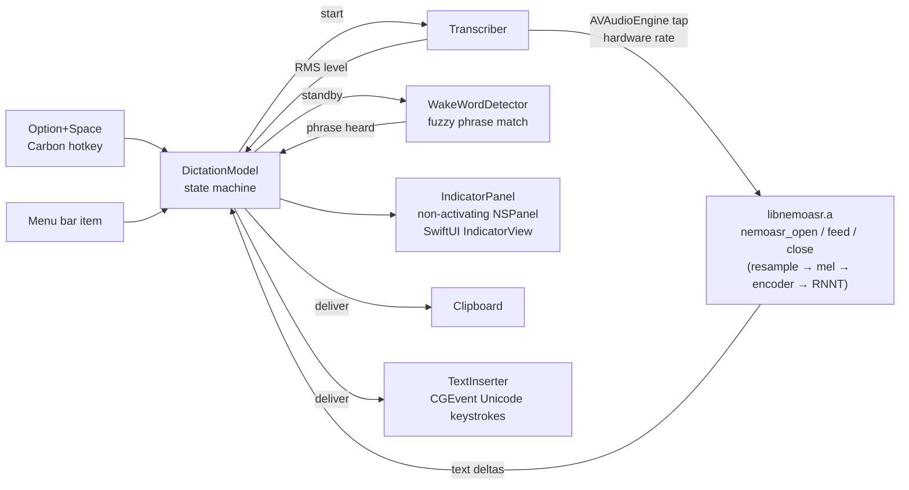

# NemoDictate

A native macOS menu-bar app for local speech recognition, built on [nemoasr-c](../nemoasr-c): NVIDIA Nemotron 3.5 ASR Streaming 0.6B implemented from scratch in C + Metal. Swift/SwiftUI for the app, the C runtime linked in as a static library. Nothing leaves the machine.

- Press **Option + Space** (or click the microphone in the menu bar) to start. A floating pill appears at the top of the screen with a pulsing dot, a live waveform of your input level and the transcript streaming in as you speak. The pill grows with the text, up to about ten lines, then scrolls so the newest words stay in view.
- Press Option + Space again (or the stop button on the pill) to finish. The text goes to the clipboard, or is typed straight into whatever text field has focus (**Output** menu), the pill shows a check mark and fades out. In the typing mode the pill never appears; instead a slight glow sits on the insertion point of the app you are dictating into, with a small black square under it (네모, Nemo, is Korean for square), swelling a little with your voice and brightening each time a chunk lands. It glides to each new caret position rather than jumping, and stretches slightly while moving. The status line is in the menu-bar menu, and the icon turns into a warning triangle if something fails.
- **Wake-word mode** (Wake word menu) keeps the microphone and the model running all the time. The menu-bar icon turns into a teal ear; say the trigger phrase ("hey nemo" by default) and transcription starts, anything said in the same breath after the phrase is kept. It stops by itself after 1.5 / 2.5 / 4 s without new words, delivers the text and goes back to waiting for the phrase. Option + Space starts a segment without the phrase, or ends one early. While standing by, the recogniser runs pinned to English at a 320 ms chunk, so the trigger is recognised quickly and no matter what language you were just speaking; each segment restarts the stream in your chosen language and latency, and the end of a segment restarts it in English again.
- Outside wake-word mode the model loads on demand each time you start, about 300 ms including GPU warm-up, and is released when you stop, so the app costs nothing while idle.

## Build and run

```bash
./Scripts/bundle.sh      # builds ../nemoasr-c as libnemoasr.a, then the app, then build/NemoDictate.app
open build/NemoDictate.app
```

The first start asks for microphone access. The ASR model must be present in the Hugging Face cache (`~/.cache/huggingface/hub/models--mlx-community--nemotron-3.5-asr-streaming-0.6b`); running the Python project in `../nemoasr` once downloads it.

Menu bar: Start/Stop, Copy Last Transcript, Language (auto-detect, English, Korean, Japanese, …), Chunk latency (80 / 320 / 560 / 1120 ms), Microphone (System Default or any connected input; the list is refreshed every time the menu opens), Output (copy to clipboard, or type into the focused text field), Wake word (enable always-listening mode, set the phrase, silence timeout), Quit. Everything persists; the microphone is remembered by its device UID, and if it is not connected the app falls back to the system default and says so in the status line.

### Typing into the focused app

"Type into the focused text field" posts the recognised text as keyboard events with Unicode payloads, so it works in any app and any script, with no clipboard round trip. macOS requires the **Accessibility** permission for that: choosing the option the first time opens the system prompt, add NemoDictate in System Settings → Privacy & Security → Accessibility, then pick the option again. The text streams in as it is recognised (the RNNT decoder never retracts, so nothing has to be deleted). If the permission is missing at delivery time the text is copied to the clipboard instead, the system prompt is raised again and the menu's status line says why.

macOS ties that permission to the app's code signature. `Scripts/bundle.sh` therefore signs with your Apple Development (or Developer ID) certificate when `security find-identity` shows one, which keeps the permission across rebuilds; with only an ad-hoc signature the permission is lost on every build and has to be re-added. `CODESIGN_ID` overrides the choice.

The caret glow finds the insertion point through the Accessibility API of the focused app: the bounds of the selected text range (the empty range itself, or the character after or before the caret), then WebKit/Chromium text-marker ranges, then, for a small single-line field only, its left edge. Electron and Chromium apps keep their accessibility tree switched off until an assistive client asks, so the first lookup in such an app sets `AXManualAccessibility` on it and the tree is up a moment later. If none of those answer, nothing is shown rather than guessing. What the lookup sees, and whether the app is trusted, is appended to `~/Library/Logs/NemoDictate.log` whenever a typing session starts or the answer changes, for apps that misbehave.

### Wake word

The trigger is matched on the ASR output word by word with a small edit distance per word (0 for words up to three letters, 1 up to five, 2 beyond), and also as a run-together string, so "hey nimo", "heynemo" and "hey, Nemo," all fire while "hey nemesis" does not. Only the words that just arrived can complete the phrase, so an old "hey nemo" can not re-trigger later. The recogniser can split a word across two chunks ("Spar" then "k"): a chunk that starts without a space continues the previous word, a match whose last word is only a prefix of the wake word is held for up to half a second for its ending, and the first dictated chunk has to start a new word, so no tail of the trigger word ends up in the text. Pick a phrase of two or three ordinary words the model spells consistently; check what it hears with `swift run nemo-feed --wake-test "your phrase"` (synthetic inputs) or by watching the transcript in push-to-talk mode.

## How it fits together



| File | Role |
|---|---|
| `Sources/NemoDictate/App.swift` | `NSApplication` bootstrap, accessory (menu-bar only) app, wires hotkey, menu and panel |
| `DictationModel.swift` | idle → loading → (standby ⇄) listening → finishing → done state, transcript, level, persisted settings, silence timeout |
| `TextInserter.swift` | Accessibility check and prompt, typing text into the focused app through `CGEvent` keyboard events |
| `CaretGlowPanel.swift` | click-through panel that follows the insertion point in typing mode; the glow and the square logo |
| `Sources/NemoCaret/CaretLocator.swift` | insertion-point lookup through the Accessibility API |
| `DebugLog.swift` | short lines to `~/Library/Logs/NemoDictate.log` about trust and caret lookups |
| `Sources/NemoAudio/WakeWordDetector.swift` | trigger-phrase matching on streaming words, per-word and run-together edit distance |
| `Transcriber.swift` | microphone permission, `AVAudioEngine` input tap, mono mix and level, calls into the C library on a serial queue |
| `IndicatorPanel.swift` / `IndicatorView.swift` | the floating pill: borderless non-activating panel on all Spaces with the native window shadow, SwiftUI content with pulsing state dot, waveform bars, streaming text, status |
| `StatusBarController.swift` | `NSStatusItem`, menu, checkmarks for language, latency, microphone, output and wake-word settings |
| `HotKey.swift` | system-wide hotkey through `RegisterEventHotKey` (no accessibility permission needed) |
| `Sources/NemoAudio/AudioInputDevice.swift` | CoreAudio input device enumeration (name, UID, rate, channels), shared with `nemo-feed --list-mics` |
| `Sources/CNemoASR` | module map exposing `../nemoasr-c/src/nemoasr.h` to Swift |
| `Sources/nemo-feed` | headless check: feeds an audio file through the same bridge and prints the transcript |
| `Scripts/bundle.sh`, `Resources/Info.plist` | assembles the `.app` (`LSUIElement`, microphone usage string), ad-hoc signed |

`NEMO_DEMO=pill swift run NemoDictate` drives the pill with canned text and no microphone, `NEMO_DEMO=caret` shows the caret effect at a fixed spot with fake typing ticks; both are for working on the UI. `swift run nemo-feed ../nemoasr-c/ref/fox48k.wav` transcribes a file through the exact Swift-to-C path the app uses, without a microphone. `swift run nemo-feed --reset-test ../nemoasr-c/ref/mixed.wav` feeds half a file as an English 320 ms stream, restarts the stream as auto-detect 560 ms with `nemoasr_reset`, and feeds the rest, the switch the wake-word mode does at every segment. `swift run nemo-feed --list-mics` prints the input devices the menu will show. `swift run nemo-feed --wake-test "hey nemo"` runs the wake-word matcher over a few synthetic transcripts.

## Notes

- The hotkey is fixed to Option + Space in `App.swift`. Change `kVK_Space` / `optionKey` there if it clashes with something you use.
- Audio is captured at the device's native rate and resampled inside the C library (windowed sinc), the same path the CLI uses.
- Latency 560 ms is the default: text appears about 0.6 s behind your speech. 80 ms is snappier but less accurate.
- In wake-word mode the model stays loaded (about 1.6 GB peak memory footprint) and the GPU runs one encoder chunk per latency interval; it is meant for a session, not for leaving on for days.
- The app has no custom icon yet; the menu bar uses SF Symbols.
